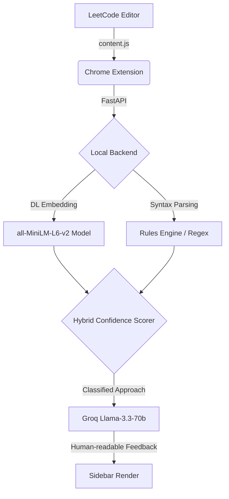

# ⚡ Coding Coach

A powerful Chrome Extension that analyzes your LeetCode code in real-time using Deep Learning. It detects algorithm patterns, explains complexity, dynamically tracks your test results, and gives AI-powered optimization tips to make you interview-ready.

---

## 🎯 What It Does

When you're solving a problem on LeetCode, simply click the **⚡ Coding Coach** button injected directly into your toolbar. The extension securely sends your code to a local FastAPI backend and opens an interactive sidebar featuring:

- **Approach Detection** — Identifies precisely which algorithm pattern you used (e.g., Brute Force, Hash Map, Binary Search).
- **Approach Explanation** — A plain English explanation of your logical flow.
- **Complexity Analysis** — Live extraction of Time complexity, Space complexity, and overall Difficulty level.
- **Optimization Tips** — AI-generated suggestions targeted at improving your specific solution.
- **Good Practices** — Highlighting what you did cleanly and efficiently.
- **Live Verdict Tracking** — Automatically scans your LeetCode test results (Accepted, Compile Error, Wrong Answer, TLE) on every run and dynamically provides immediate, context-aware tips to fix failing tests.
- **Save to History** — Pushes your attempts and scores to a Supabase database to track progress over time.

---

## 🧠 How It Works (The Architecture)



### Deep Learning Pipeline

| Component | Details |
|---|---|
| **Embedding Model** | `all-MiniLM-L6-v2` — highly efficient, CPU-friendly Sentence Transformer mapping code to 384-dim semantic vectors. |
| **Detection Method** | Zero-Shot Semantic Similarity mapped against canonical algorithm definitions. |
| **Hybrid Logic** | Seamless combination of Neural Network probabilistic similarity (ML) + deterministic Symbolic software architectures (Regex/Syntax). |

### 8 Base Algorithm Classes
*Brute Force, Sliding Window, Dynamic Programming, Backtracking, Modified Binary Search, Prefix Sum, Hash Map, Two Pointers.*

### Tech Stack

| Layer | Technology |
|---|---|
| **Frontend** | Chrome Extension (Manifest V3, Vanilla JS) |
| **Backend API** | Python, FastAPI, Uvicorn |
| **Deep Learning** | `sentence-transformers`, `torch`, `numpy` |
| **LLM Inference** | Groq API (`llama-3.3-70b-versatile`) |
| **Database** | Supabase (PostgreSQL) |

---

## 🚀 Setup & Installation

### 1. Clone the repo
```bash
git clone https://github.com/yourusername/coding-coach.git
cd coding-coach
```

### 2. Set up Python backend
```bash
cd backend
python -m venv venv
venv\Scripts\activate        # Windows
source venv/bin/activate     # Mac/Linux

pip install fastapi uvicorn sentence-transformers numpy supabase groq pydantic
```

### 3. Configure environment variables
Create `backend/.env`:
```env
SUPABASE_URL=your_supabase_url
SUPABASE_KEY=your_supabase_anon_key
GROQ_API_KEY=your_groq_api_key
```

> **Get free keys:**
> - Groq API: [console.groq.com](https://console.groq.com)
> - Supabase: [supabase.com](https://supabase.com)

### 4. Start the backend server
```bash
cd backend
uvicorn main:app --reload
```
*Server runs at `http://127.0.0.1:8000`. Hot-reloading enabled.*

### 5. Load the Chrome Extension
1. Open Chrome and go to `chrome://extensions`
2. Enable **Developer mode** (top right toggle)
3. Click **Load unpacked**
4. Select the `coding-coach/extension` folder
5. Extension is now active on LeetCode! ✅

---

## 🧪 API Endpoints

| Endpoint | Method | Description |
|---|---|---|
| `/` | GET | Health check |
| `/api/analyze-only` | POST | Full approach analysis without database commit |
| `/api/analyze-verdict` | POST | Generates specific failure-tips tailored to LeetCode verdicts |
| `/api/save-submission` | POST | Saves analysis and code submission to Supabase |
| `/api/history` | GET | Fetches saved submission history |
| `/api/score` | GET | Computes comprehensive interview readiness score |

---

## 🎓 Academic / Project Note

This application showcases applied Deep Learning integrated into a practical web application. 
- Demonstrates **Zero-Shot Semantic Similarity** to classify abstract user code without requiring massive labelled custom datasets.
- Utilizes **Edge-efficient ML Deployments** (22M parameter models) ensuring low-latency inference on consumer CPUs. 
- Implements **Neurosymbolic AI** — trusting standard code lexers/parsers for deterministic structures, and neural embeddings for abstract algorithmic intent.

---

## 📝 License

MIT License — feel free to use and modify.
