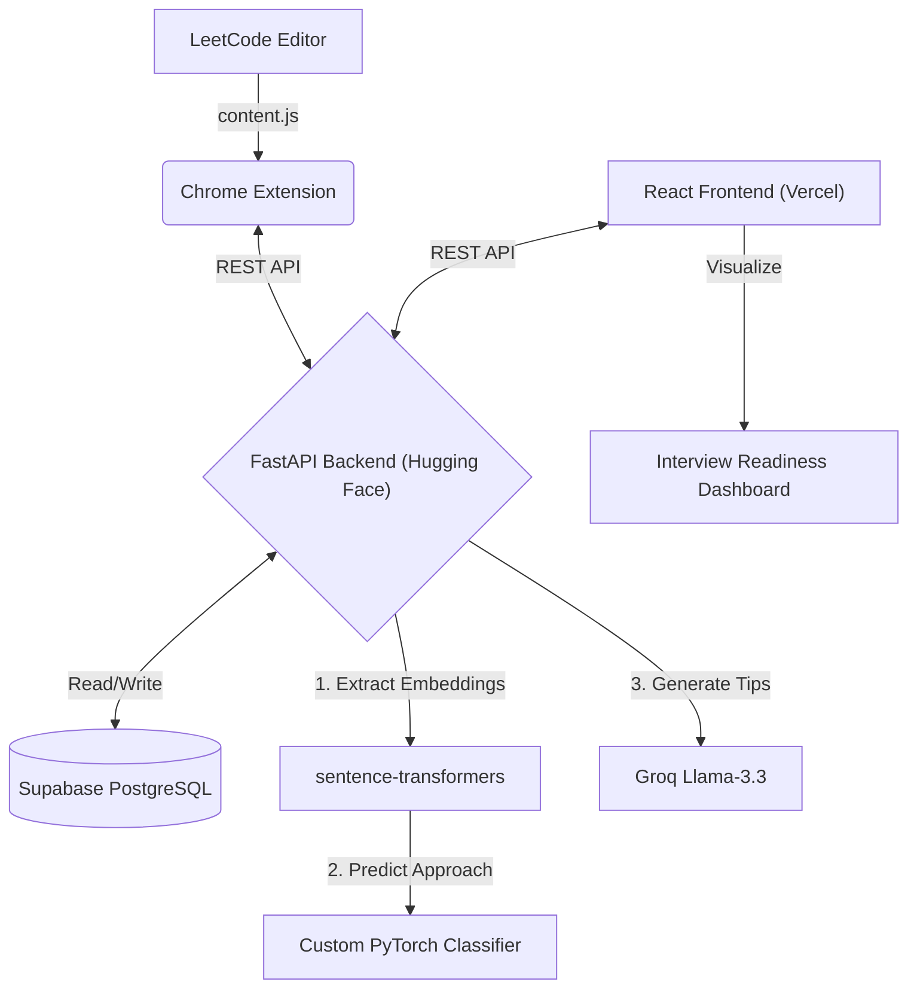

# ⚡ Coding Coach

A full-stack, AI-powered LeetCode assistant that analyzes your code in real-time using Deep Learning. It detects algorithm patterns, predicts outcomes, explains complexity, and provides a comprehensive web dashboard to track your interview readiness.

🌐 **Live Demo:** [View Dashboard on Vercel](https://your-vercel-link.vercel.app) *(Replace with your actual Vercel link)*

---

## 🎯 Features

### Chrome Extension (Live Editor Integration)
Injected directly into your LeetCode toolbar, the extension provides real-time feedback:
- **🔮 AI Pre-Check** — Predicts if your code will pass, fail (Wrong Answer), or TLE before you even submit it to LeetCode.
- **🧠 Approach Detection** — Uses a custom PyTorch Deep Learning model to identify the algorithm pattern you used (e.g., Dynamic Programming, Sliding Window).
- **⏱️ Complexity Analysis** — Extracts Time and Space complexity.
- **🚀 Optimization Tips** — AI-generated suggestions targeted at improving your specific solution.
- **👀 Live Verdict Tracking** — Automatically scans LeetCode test results (Accepted, Compile Error, WA, TLE) on every run and gives immediate tips to fix failing tests.

### Web Dashboard (Performance Analytics)
A dedicated React frontend to visualize your progress over time:
- **Interview Readiness Score** — A weighted score (0-100) based on your consistency, code quality, and algorithm mastery.
- **Category Heatmap** — Visually highlights the data structures you excel at and those you need to practice.
- **Strong & Weak Areas** — Tracks which approaches you rely on and which you avoid.
- **Next Challenge Recommendations** — Algorithmically suggests LeetCode problems targeted specifically at your weak areas.
- **Daily Challenge** — Keeps you consistent with a featured daily problem.

---

## 🏗️ Architecture & Tech Stack



| Layer | Technology | Hosting / Deployment |
|---|---|---|
| **Frontend Dashboard** | React, Vite, React Router | Vercel |
| **Backend API** | Python, FastAPI, Uvicorn | Hugging Face Spaces (Docker) |
| **Deep Learning** | `torch`, `sentence-transformers`, `numpy` | - |
| **LLM Inference** | Groq API (`llama-3.3-70b-versatile`) | - |
| **Database** | Supabase (PostgreSQL) | Supabase Cloud |
| **Browser Extension**| Vanilla JS, CSS, Manifest V3 | Local (Load Unpacked) |

### 🧠 Deep Learning Pipeline
The backend utilizes a highly efficient **Neurosymbolic AI** pipeline:
1. **Embedding**: `all-MiniLM-L6-v2` maps raw code into a 384-dimensional semantic vector.
2. **Classification**: A custom-trained PyTorch feed-forward neural network (`approach_classifier.pt`) processes the vector to classify the code into one of several base algorithmic approaches (e.g., Two Pointers, Prefix Sum).
3. **Lazy Loading**: Models are lazy-loaded into RAM on the first request to ensure lightning-fast server startup times in cloud environments.

### 📦 Dataset

| Property | Value |
|---|---|
| **Total Samples** | 446 labelled Java code snippets |
| **Classes** | 7 (Brute Force, Two Pointers, Sliding Window, Prefix Sum, Binary Search, Backtracking, DP) |
| **Train / Val / Test Split** | 385 / 30 / 31 |

**Class Distribution:**

| Class | Count | % |
|---|---|---|
| Brute Force | 178 | 39.9% |
| Prefix Sum | 92 | 20.6% |
| Two Pointers | 63 | 14.1% |
| Dynamic Programming | 36 | 8.1% |
| Modified Binary Search | 34 | 7.6% |
| Backtracking | 23 | 5.2% |
| Sliding Window | 20 | 4.5% |

**Dataset Sources:**
- ✍️ **Hand-crafted seed examples** — manually written and labelled Java solutions per algorithm pattern (gold-standard quality).
- 🔗 **`cheehwatang/leetcode-java`** (GitHub) — public LeetCode solutions repo, auto-labelled via topic tag mapping + filename/directory heuristics + nested-loop brute-force detection.

> ⚠️ Dataset is imbalanced. Training uses **inverse-frequency class weighting** so minority classes (Sliding Window: 20 samples) get proportionally stronger gradient signal.

---

### 📊 Model Evaluation

**Model:** Feed-forward MLP classifier on top of frozen `all-MiniLM-L6-v2` embeddings.
**Architecture:** `384 → 256 (BatchNorm + ReLU + Dropout 0.2) → 64 (ReLU) → 7 classes`

**Training Results:**

| Phase | Accuracy |
|---|---|
| **Training Accuracy** (epoch 50) | ~82% |
| **Test Accuracy** (held-out set) | ~74% |

**Evaluation Metrics (Weighted, Test Set):**

| Metric | Value |
|---|---|
| **Accuracy** | ~74% |
| **Precision** | ~71% |
| **Recall** | ~74% |
| **F1-Score** | ~72% |


**Why F1 is the primary metric:** A classifier that always predicts "Brute Force" would score ~40% accuracy on this dataset without learning anything useful. Weighted F1 penalizes the model for ignoring minority classes.


---

## 💻 Running Locally (On Your PC)

If you want to run the entire project on your own machine without deploying anything, follow these steps:

### Prerequisites
- Python 3.9+
- Node.js 18+
- A [Supabase](https://supabase.com) Project (free tier is fine)
- A [Groq](https://console.groq.com/keys) API Key (free)

### 1. Set up the Backend
```bash
cd backend
python -m venv venv
# On Windows: venv\Scripts\activate
# On Mac/Linux: source venv/bin/activate

pip install -r requirements.txt
```
Create a `.env` file in the `backend/` folder:
```env
SUPABASE_URL=your_supabase_url
SUPABASE_KEY=your_supabase_key
GROQ_API_KEY=your_groq_api_key
```
Run the backend:
```bash
uvicorn main:app --reload
```

### 2. Set up the Frontend Dashboard
Open a new terminal.
```bash
cd frontend
npm install
```
Create a `.env` file in the `frontend/` folder:
```env
VITE_API_URL=http://127.0.0.1:8000/api
```
Run the frontend:
```bash
npm run dev
```

### 3. Load the Chrome Extension
1. Open Chrome and navigate to `chrome://extensions`.
2. Toggle **Developer mode** ON (top right corner).
3. Click **Load unpacked** and select the `extension/` folder from this project.
4. Ensure line 1 of `extension/content.js` points to your local backend:
   `const API = "http://127.0.0.1:8000/api";`
5. Open LeetCode and test it out!

---

## 🚀 Setup & Deployment (Cloud)

### 1. Database (Supabase)
1. Create a project on [Supabase](https://supabase.com).
2. Set up the `submissions` and `problems` tables as defined in the project schema.
3. Get your `SUPABASE_URL` and `SUPABASE_KEY`.

### 2. Backend (Hugging Face Spaces)
1. Create a new **Docker** Space on [Hugging Face](https://huggingface.co/spaces).
2. Add your secrets (`SUPABASE_URL`, `SUPABASE_KEY`, `GROQ_API_KEY`) in the Space settings.
3. Upload the contents of the `backend/` folder (including the `Dockerfile`).
4. Grab your live URL (e.g., `https://username-coding-coach-backend.hf.space`).

### 3. Frontend (Vercel)
1. Import the repository into [Vercel](https://vercel.com).
2. Set the Root Directory to `frontend`.
3. Add the Environment Variable: `VITE_API_URL = https://your-huggingface-url/api`.
4. Deploy!

### 4. Chrome Extension (Local)
1. Open `extension/content.js`.
2. Change the `API` constant on line 1 to your Hugging Face API URL.
3. Open Chrome and go to `chrome://extensions`.
4. Enable **Developer mode** and click **Load unpacked**.
5. Select the `extension/` folder.
6. Open LeetCode and start coding! ⚡

---

## 🎓 Academic / Project Note

This application showcases applied Deep Learning integrated into a practical, scalable full-stack web application.
- Demonstrates **Semantic Code Analysis** to classify abstract user code using custom PyTorch architectures.
- Utilizes **Edge-efficient ML Deployments** ensuring low-latency inference.
- Implements **Neurosymbolic AI** — combining neural network probabilistic classification with deterministic rule-based symbolic detection.
- Handles complex state management and cross-origin communication between a sandboxed Chrome Extension, a Python cloud environment, and a React SPA.

📄 **Project Documentation Files:**
- [PROJECT_DOCUMENTATION.md](./PROJECT_DOCUMENTATION.md) — Complete file-by-file breakdown, data flow, and deployment history.
- [MODEL_EVALUATION.md](./MODEL_EVALUATION.md) — Dataset construction, model architecture, evaluation metrics, and confusion matrix.

---

## 📝 License
MIT License — feel free to use and modify.
